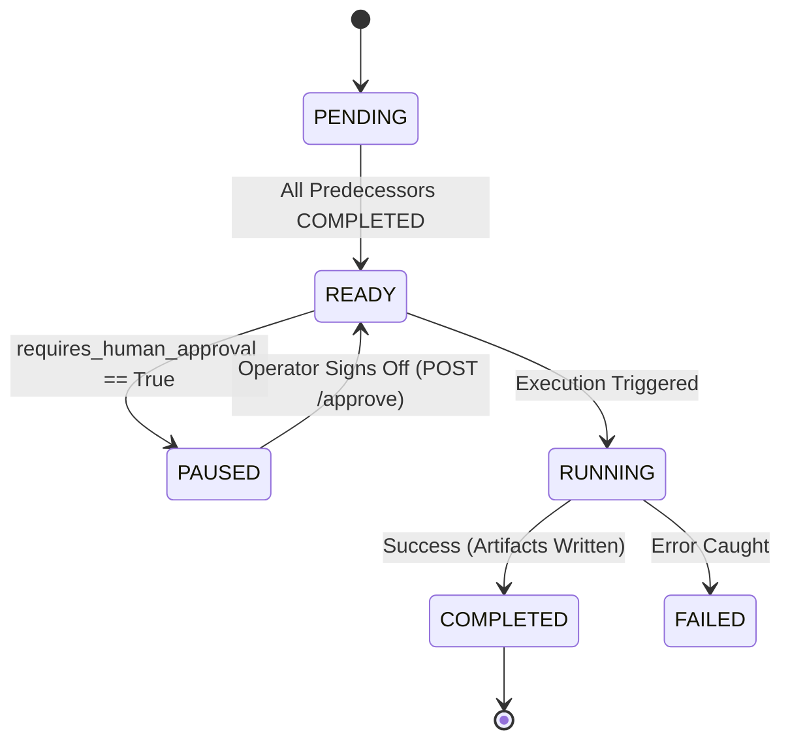
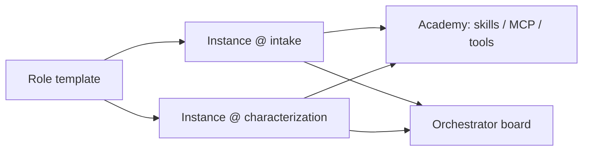

# CBRN Rapid Response — architecture

This document details the software engineering design, concurrency model, data contracts, and architectural decisions underlying **CBRN Rapid Response** (package `pandemic_prep_dash`).

---

## 1. Architectural Overview

PandemicPrepDash is designed around four foundational pillars:
1. **Adaptive Directed Acyclic Graph (DAG) Orchestration Engine**: Manages non-linear, branching, and converging analytical pipelines.
2. **Specialized Agentic Squads**: Multi-agent squads with distinct scientific personas, deliberation phases, and tool execution traces.
3. **Whole-of-Australian-Government (WoAG) Reporting Matrix**: Automated, statutory-aligned situation report synthesis for Commonwealth agencies.
4. **Human-in-the-Loop (HITL) Security Governance**: Statutory gatekeeper nodes enforcing human sign-off on CBRN, dual-use, and Tier 1 SSBA classifications.

```mermaid
graph TB
    subgraph Frontend [Web Command Dashboard]
        UI[Interactive UI & SVG DAG Visualizer]
        NodeInspector[Node & Agent Inspector]
        AgencyHub[Whole-of-Gov Briefings Hub]
        Countermeasures[Molecular & Drug Inventory]
        AgentFeed[Deliberation Trace Feed]
    end

    subgraph API [FastAPI Service Layer]
        RouterPathways[/api/pathways]
        RouterExecution[/api/execution]
        RouterAgencies[/api/agencies]
        RouterScenarios[/api/scenarios]
        RouterAgents[/api/agents]
    end

    subgraph Core [DAG Execution Engine]
        StateManager[State Manager]
        Engine[PathwayExecutionEngine]
        GraphSolver[NetworkX Graph & Cycle Detector]
        NodeExec[NodeExecutor]
    end

    subgraph Agents [Agent Squads & Deliberation]
        BioSquad[Bioinformatics Squad<br>Dr. Elena Rostova]
        StructSquad[Structural Biology Squad<br>Dr. Marcus Vance]
        MedChemSquad[Medicinal Chemistry Squad<br>Dr. Priya Sharma]
        VacSquad[Vaccinology Squad<br>Dr. Liam O'Connor]
        CBRNSquad[CBRN Biosecurity Squad<br>Cdr. Jack Sterling]
        PolicySquad[Policy Liaison Squad<br>Alison Bradley PSM]
    end

    subgraph Blackboard [Shared Artifact State]
        SampleArtifact[Biological / Chemical Specimen]
        IdentArtifact[Pathogen & Mutation Annotation]
        TargetArtifact[3D Protein Targets & Pockets]
        DrugArtifact[Repurposed Antivirals / Antidotes]
        VacArtifact[mRNA Epitope Constructs]
        ThreatArtifact[SSBA & Dual-Use Audit]
        ReportsArtifact[Tailored Agency Briefings]
    end

    subgraph Agencies [Australian Government Integration]
        ACDC[ACDC: Epidemic Sitrep]
        TGA[TGA: Regulatory Dossier]
        DAFF[DAFF: Zoonotic Alert]
        DSTG[DSTG: CBRN Intelligence]
        NEMA[NEMA: Supply Chain Brief]
        DFAT[DFAT: WHO Notification]
        CSIRO[CSIRO: ACDP Lab Brief]
        OGTR[OGTR: Biosafety Notice]
    end

    UI --> API
    API --> Core
    Engine --> GraphSolver
    Engine --> NodeExec
    NodeExec --> Agents
    Agents --> Blackboard
    Blackboard --> Agencies
```

---

## 2. DAG Execution Semantics & State Machine

### 2.1. Node States
A node in the pathway undergoes the following lifecycle states:



- **Topological Invariant**: An edge $u \to v$ can only be added if the resulting graph has zero directed cycles ($\text{DAG} = \text{True}$). NetworkX tests this via `nx.is_directed_acyclic_graph(temp_g)`.
- **In-Degree Calculation**: For any node $v$, its in-degree $\text{deg}^-(v)$ represents the number of direct upstream dependencies. Node $v$ transitions from `PENDING` to `READY` when:
  $$\forall u \in \text{Predecessors}(v), \quad \text{Status}(u) = \text{COMPLETED}$$

### 2.2. Concurrency & Branching Pattern
In a biological incident:
1. `node_sample_ingestion` executes first.
2. `node_genomic_characterization` executes next.
3. Upon completion of characterization, the DAG forks concurrently into two branches:
   - Branch A: `node_structural_modeling`
   - Branch B: `node_biosecurity_assessment` (with HITL gatekeeper)
4. From `node_structural_modeling`, the graph forks again concurrently into:
   - Branch A1: `node_therapeutic_screening`
   - Branch A2: `node_vaccine_design`
5. All branches converge into `node_agency_briefing_synthesis`, which runs only when Therapeutics, Vaccine Design, and Biosecurity have all finished.

---

## 3. Shared Blackboard / State Machine

Nodes communicate strictly through an append-and-enrich shared memory pattern known as the **Blackboard Pattern**:

| Artifact Key | Producer Node | Consumer Nodes | Content Description |
|---|---|---|---|
| `sample` | `node_sample_ingestion` | All downstream | Raw payload, sequence length, geographic point of collection, metadata. |
| `identification` | `node_genomic_characterization` | Structural, Biosecurity, Reporting | BLAST alignment identity, clade lineage, point mutations (e.g. PB2 E627K). |
| `protein_targets` | `node_structural_modeling` | Therapeutics, Vaccinology, Reporting | 3D AlphaFold models, pLDDT confidence scores, active pocket volumes (ų). |
| `drug_candidates` | `node_therapeutic_screening` | Reporting, TGA | Repurposed small molecules, binding affinities (kcal/mol), ARTG status, NMS stockpile levels. |
| `vaccine_candidates` | `node_vaccine_design` | Reporting, TGA, CSIRO | mRNA-LNP constructs, neutralizing B/T-cell epitopes, domestic manufacturing facilities. |
| `threat_assessment` | `node_biosecurity_assessment` | Reporting, DSTG, NEMA | SSBA Tier 1/2 classification, gain-of-function evidence, aerosolization risk. |
| `agency_reports` | `node_agency_briefing_synthesis` | UI & Agency Dispatches | Bespoke statutory briefings for ACDC, TGA, DAFF, DSTG, NEMA, DFAT, CSIRO, OGTR. |

---

## 4. Agent Squad Deliberation Protocol

Each node is backed by an `AgentTeamConfig` featuring distinct scientific personas. When a node executes, its assigned agents record an immutable sequence of deliberation events conforming to `AgentThoughtLog`:

```python
class AgentThoughtLog(BaseModel):
    id: str
    timestamp: str
    agent_id: str
    agent_name: str
    agent_role: str
    node_id: str
    phase: AgentThoughtPhase  # observation, hypothesis, tool_execution, synthesis
    message: str
    tool_name: Optional[str] = None
    tool_input: Optional[Dict[str, Any]] = None
    tool_output_summary: Optional[str] = None
    confidence: float
```

### Extensibility to Real LLM APIs
The node executor is structured to easily bind to real LLM backends (Gemini 1.5/2.0, Claude 3.5, GPT-4o, or local Ollama instances) and external bioinformatic tools (NCBI BLAST API, Foldseek, AutoDock Vina CLI) by subclassing or configuring `NodeExecutor`.

### 4.1 Role templates vs node-bound instances

Today `AGENT_PERSONAS` are **role templates** (job descriptions): `AGENT-BIOINFO-LEAD-01` is the bioinformatics lead *role*. Several squads historically referenced the same Python object, which made it look as if one agent worked every genomics-adjacent node.

The intended model is:

| Layer | Identity | Shares |
|---|---|---|
| Role template | `agent_bioinfo_lead` | Default tools, skills, MCP list, system prompt |
| Node instance | `{node_id}::{persona_id}` e.g. `node_genomic_characterization::agent_bioinfo_lead` | Nothing. Own academy log, own working memory, own skill currency |

**Separate agents per node is the rule.** Two nodes may use the same *role template* so a workshop can see “this is a bioinformatics lead job”. They must not share instance state. If intake and characterization both need a bioinformatics lead, they get two instances. That prevents a briefing node from inheriting a lab node’s unstated assumptions.

The **Crews & Academy** tab lists instances, not templates.

### 4.2 Agent Academy (skills, MCP, tools)

Academy is a **currency loop**, not model training.

- **Skills** — refresh the assigned government skill pack (playbooks, statutory notes).
- **MCP** — re-check which Model Context Protocol servers this instance is allowed to call.
- **Tools** — look up software/version notes relevant to the field (BLAST, HYSPLIT-shaped methods, docking, etc.).

Attendance writes a simulated session onto the instance and a note on the control-hub board. It does **not** update weights, install packages, or contact live MCP endpoints. In a later platform, Academy would pull versioned skill files and fail closed if a tool is stale.

### 4.3 Control-hub orchestrator board

The existing human–agent message board is the right place for problems. The orchestrator should **surface**, not silently fix:

- Open blockers (HITL, missing evidence)
- Lead-context `unknown` answers
- Academy overdue on a node lead

A human posts the issue to `@all` or a node. Agents do not dispatch from the board. This is second eyes for the *software crews*, parallel to second eyes on the incident.



---

## 5. Whole-of-Government Agency Reporting Engine

The `AgencyReportGenerator` maps scientific findings into Commonwealth emergency structures. Rather than producing generic summaries, each briefing is synthesized against specific statutory responsibilities:

1. **ACDC Briefing:** Formats alerts for the Communicable Diseases Network Australia (CDNA) and Public Health Laboratory Network (PHLN), providing case definitions and R0 projections.
2. **TGA Dossier:** Cross-references the Australian Register of Therapeutic Goods (ARTG), evaluates Section 19A emergency exemptions, and highlights API storage requirements.
3. **DAFF Alert:** Triggers animal containment zones under the Australian Chief Veterinary Officer (ACVO) and updates Biosecurity Import Conditions (BICON).
4. **DSTG Assessment:** Classifies threats under the *National Health Security Act 2007* (SSBA Tier 1/2) and Chemical Weapons Convention (CWC).
5. **NEMA Logistics:** Audits National Medical Stockpile (NMS) burn rates, cold-chain logistics, and COMDISPLAN activation triggers.
6. **DFAT Notification:** Drafts notifications under Article 6 of the WHO International Health Regulations (IHR 2005).

---

## 6. Security considerations for a later Australian Government platform

This demonstrator is **not accredited**. It has no login, one shared in-memory incident, and simulated analysis. The notes below are requirements for a future operational system, not claims about the current software.

Australian Government systems are assessed against Australian frameworks first:

| Framework | Role | Official source |
|---|---|---|
| Protective Security Policy Framework (PSPF) | Classification, need-to-know, personnel and physical security | [protectivesecurity.gov.au](https://www.protectivesecurity.gov.au/) |
| Information Security Manual (ISM) | Technical cyber controls for systems and data | [ISM on cyber.gov.au](https://www.cyber.gov.au/resources-business-and-government/essential-cyber-security/ism) |
| Essential Eight | Baseline mitigations (patch, MFA, restrict admin, backups, application control, …) | [Essential Eight](https://www.cyber.gov.au/resources-business-and-government/essential-cyber-security/essential-eight) |
| IRAP | Independent assessment of cloud/services up to a classification (commonly PROTECTED) | [IRAP](https://www.cyber.gov.au/resources-business-and-government/essential-cyber-security/irap) |
| Privacy Act 1988 / APPs | Personal and health information | [OAIC APPs](https://www.oaic.gov.au/privacy/australian-privacy-principles) |
| National Health Security Act 2007 / SSBA | Security-sensitive biological agents | [NHS Act](https://www.legislation.gov.au/C2007A00174/latest), [SSBA](https://www.health.gov.au/our-work/security-sensitive-biological-agents) |

**Application controls (must exist before any CBRN data is real)**

1. Identity and authorisation: agency, role, classification, need-to-know. Approvals are authorised actions, not a client flag (`auto_approve` is not a security boundary).
2. Incident-scoped durable state; no shared global engine across browsers.
3. Append-only decision log bound to an actor (who approved, on what evidence).
4. Server-side redaction of briefs before serialize.
5. Logging to a government SIEM; encryption in transit and at rest.

**Host and supply chain (where OpenSCAP belongs)**

[OpenSCAP](https://www.open-scap.org/) implements [NIST SCAP](https://csrc.nist.gov/projects/security-content-automation-protocol) (XCCDF/OVAL) for **machine hardening** (typically CIS or vendor content on RHEL/Ubuntu images). ASD does **not** publish an official ISM OpenSCAP datastream. OpenSCAP is appropriate in the **image/build pipeline** and periodic host scan for a later enclave. It must not appear in the incident UI as “ISM passed”. Pair it with SBOM, dependency scanning, and pinned builds.

**This demonstrator implements only**

- Demo security headers (`X-Content-Type-Options`, `X-Frame-Options`, `Referrer-Policy`, `Permissions-Policy`).
- CORS limited to the local demo origin (override with `CORS_ORIGINS`).
- Honest labels: no accreditation, policies listed as **not implemented**.
- Help chapter *Security considerations* with the same official links.

It does **not** implement MFA, ISM overlays, IRAP, OpenSCAP scans, or agency ACLs.

---

## 7. Directory Structure

```
PandemicPrepDash/
├── pyproject.toml                      # Build & dependency management
├── README.md                           # Project documentation & quickstart
├── ARCHITECTURE.md                     # Engineering blueprint & state machine
├── docs/
│   ├── australian_agencies.md         # WoAG agency landscape & statutory acts
│   ├── scenarios.md                   # Detailed threat scenario walkthroughs
│   └── adr/                           # Architectural Decision Records
│       ├── ADR-001-dag-workflow-architecture.md
│       ├── ADR-002-agentic-team-contract.md
│       ├── ADR-003-multi-agency-briefing-system.md
│       └── ADR-004-human-in-the-loop-gatekeeper.md
├── src/
│   └── pandemic_prep_dash/
│       ├── __init__.py
│       ├── main.py                     # FastAPI entrypoint & server
│       ├── models/                     # Pydantic schemas
│       │   ├── bio_chem.py             # Molecular, structural, countermeasure schemas
│       │   ├── agency.py               # Agency profiles, reports, classifications
│       │   ├── agent.py                # Agent personas, teams, thought logs
│       │   └── pathway.py              # Nodes, edges, DAG runs, statuses
│       ├── core/                       # Core orchestration
│       │   ├── engine.py               # DAG execution engine & NetworkX solver
│       │   ├── node_executor.py        # Node runner & agent deliberation engine
│       │   ├── state_manager.py        # Application state manager
│       │   └── registry.py             # Default biological & chemical pathways
│       ├── agents/                     # Agent definitions
│       │   └── teams.py                # Personas (Dr. Rostova, Vance, Sharma, etc.)
│       ├── agencies/                   # Australian agency reporting
│       │   ├── registry.py             # Agency database & statutory mandates
│       │   └── generator.py            # Report synthesis engine
│       ├── scenarios/                  # Threat scenario datasets
│       │   ├── h5n1_avian_flu.py       # Avian flu spillover scenario
│       │   ├── novel_coronavirus.py    # Synthetic coronavirus scenario
│       │   └── nerve_agent_toxin.py    # Organophosphate CBRN scenario
│       └── api/                        # REST API routes
│           ├── routes_scenarios.py
│           ├── routes_pathways.py
│           ├── routes_execution.py
│           ├── routes_agencies.py
│           └── routes_agents.py
├── static/                             # Web Frontend Command Dashboard
│   ├── index.html                      # Single-page application shell
│   ├── app.js                          # Client-side DAG visualizer & state logic
│   └── styles.css                      # Custom styling, animations, node glow
└── tests/                              # Comprehensive test suite
    ├── conftest.py
    ├── test_dag_engine.py              # DAG, cycles, approval, chemical tests
    └── test_api.py                     # REST endpoints & agency export tests
```
