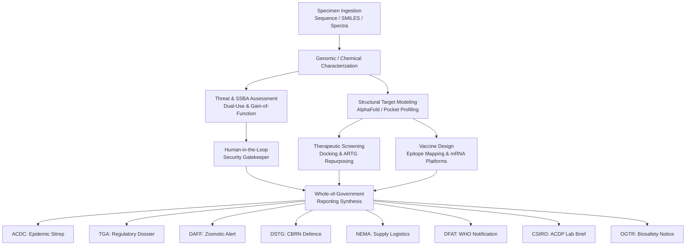

# Whole-of-Australian-Government (WoAG) CBRN & Pandemic Preparedness Landscape

This document captures the institutional architecture, statutory mandates, operational responsibilities, and intelligence flows across Commonwealth and jurisdictional agencies in Australia during a Chemical, Biological, Radiological, or Nuclear (CBRN) or pandemic incident.

---

## 1. Executive Summary & Statutory Framework

Australia's response to emerging biological threats, pandemics, and CBRN hazards is governed by interlocking Commonwealth legislation and inter-governmental agreements:

| Legislation / Framework | Primary Agency | Key Statutory Powers & Focus |
|---|---|---|
| **National Health Security Act 2007 (Cth)** | DoHAC / Australian CDC | Regulation of Security Sensitive Biological Agents (SSBA Tier 1 & 2), national public health surveillance, WHO IHR national focal point. |
| **Biosecurity Act 2015 (Cth)** | DAFF / Health | Border biosecurity screening, human biosecurity emergency declarations, livestock quarantine zones, prevention of zoonotic incursions. |
| **Therapeutic Goods Act 1989 (Cth)** | TGA | Evaluation and registration of medicines, Section 19A emergency exemptions, Special Access Scheme (SAS), GMP batch release of vaccines. |
| **Gene Technology Act 2000 (Cth)** | OGTR | Environmental risk assessment, licensing of genetically modified organisms (GMOs), oversight of synthetic biology and viral vectors. |
| **Defence Act 1903 (Cth) & WMD Act 1995** | Defence / DSTG | CBRN defence counter-measures, counter-proliferation, physical force health protection, chemical weapons convention enforcement. |
| **National Health Emergency Response Arrangements (NatHealth)** | All Commonwealth & State | Operational blueprint coordinating Australian Government health responses with State/Territory public health emergency units. |

---

## 2. Participating Australian Agencies

### 2.1. Australian Centre for Disease Control (Interim ACDC)
* **Portfolio:** Department of Health and Aged Care (DoHAC)
* **Role:** Central coordination hub for infectious disease surveillance, epidemic modeling, and national public health advice.
* **Key Functions:**
  - Integrates genomic epidemiology from state and national reference laboratories.
  - Maintains the National Notifiable Diseases Surveillance System (NNDSS).
  - Formulates national clinical surveillance case definitions with the Communicable Diseases Network Australia (CDNA).
  - Issues strategic briefings to the Chief Medical Officer (CMO) and the National Incident Room (NIR).
* **Output Format in PandemicPrepDash:** *Epidemiological Situation Report (SITREP)* detailing R0 estimates, transmission vectors, incubation periods, clinical attack rates, and ICU surge alerts.

---

### 2.2. Therapeutic Goods Administration (TGA)
* **Portfolio:** Department of Health and Aged Care (DoHAC)
* **Role:** National regulator of therapeutic goods, medicines, vaccines, and diagnostic medical devices.
* **Key Functions:**
  - Evaluates quality, safety, and efficacy of repurposed pharmaceuticals and novel biologicals.
  - Fast-tracks emergency access via Section 19A exemptions (importing unapproved medicines to prevent medicine shortages).
  - Grants Provisional Registration for urgent medical countermeasures (e.g. mRNA vaccines, protease inhibitors).
  - Coordinates with the National Medical Stockpile (NMS) on API reserves and cold-chain integrity.
* **Output Format in PandemicPrepDash:** *Medical Countermeasure & Regulatory Readiness Dossier* detailing candidate binding affinities, ARTG status, NMS stockpile levels, and expedited evaluation pathways.

---

### 2.3. Department of Agriculture, Fisheries and Forestry (DAFF - Biosecurity)
* **Portfolio:** Department of Agriculture, Fisheries and Forestry
* **Role:** Protecting Australia's animal, plant, and agricultural biosecurity from zoonotic incursions and high-consequence pests.
* **Key Functions:**
  - Leads One-Health surveillance of zoonotic pathogens (Avian Influenza H5N1, Swine Influenza, Henipavirus, Lyssavirus).
  - Enforces Biosecurity Import Conditions (BICON) at international maritime and aviation ports of entry.
  - Convenes the Consultative Committee on Emergency Animal Diseases (CCEAD).
  - Directs animal containment buffers, quarantine boundaries, and cull/depopulation strategies under the Australian Chief Veterinary Officer (ACVO).
* **Output Format in PandemicPrepDash:** *One-Health Zoonotic Alert* detailing species tropism, mammalian mutation markers (e.g. PB2 E627K), geographic quarantine perimeters, and agricultural trade impacts.

---

### 2.4. Defence Science and Technology Group (DSTG) & Defence CBRN
* **Portfolio:** Department of Defence
* **Role:** Lead national security science agency for CBRN defence, signature attribution, and force health protection.
* **Key Functions:**
  - Analyzes dual-use synthetic biology signatures, gain-of-function insertions, and non-natural codon usage.
  - Conducts physical and chemical forensic characterization of unknown nerve agents, blister agents, and toxins.
  - Models aerosol persistence, meteorological dispersion, and military decontamination protocols.
  - Coordinates scientific intelligence with Five-Eyes defence partners (The Technical Cooperation Program - TTCP).
* **Output Format in PandemicPrepDash:** *CBRN Threat Intelligence Assessment* detailing SSBA classifications, dual-use red flags, aerosolization potential, OPCW/CWC compliance, and forensic attribution.

---

### 2.5. National Emergency Management Agency (NEMA)
* **Portfolio:** Department of Home Affairs
* **Role:** Coordinating civil defense, crisis logistics, and multi-jurisdictional non-health emergency response across Australia.
* **Key Functions:**
  - Administers the Australian Government Disaster Response Plan (COMDISPLAN).
  - Models supply chain resilience, transport bottlenecks, and national critical infrastructure dependencies (air cargo, cold-chain distribution, medical oxygen).
  - Delivers daily crisis briefings to the National Security Committee (NSC) of Cabinet.
  - Coordinates Australian Defence Force (ADF) civil liaison assistance when state capacities are exceeded.
* **Output Format in PandemicPrepDash:** *Crisis Logistics & Emergency Supply Chain Brief* highlighting resource burn rates, PPE reserves, cold-chain refrigeration thresholds, and transport corridors.

---

### 2.6. Department of Foreign Affairs and Trade (DFAT)
* **Portfolio:** Department of Foreign Affairs and Trade
* **Role:** International diplomatic liaison, compliance with multilateral treaties, and regional health security.
* **Key Functions:**
  - Delivers Australia's mandatory notification to the World Health Organization (WHO) Western Pacific Regional Office (WPRO) under Article 6 of the International Health Regulations (IHR 2005).
  - Coordinates Indo-Pacific Centre for Health Security bilateral assistance to Pacific Island Countries (PICs) and ASEAN partners.
  - Updates Smartraveller travel advice and coordinates international border advisory notices.
* **Output Format in PandemicPrepDash:** *International Health Security & Diplomatic Notification* detailing WHO IHR trigger compliance, regional Pacific vulnerabilities, and consular recommendations.

---

### 2.7. CSIRO - Australian Centre for Disease Preparedness (ACDP)
* **Portfolio:** Industry, Science and Resources
* **Role:** Sovereign high-containment (Physical Containment Level 4 - PC4) diagnostics and biotechnology innovation.
* **Location:** Geelong, Victoria
* **Key Functions:**
  - Physical isolation, biological culture, and cryo-electron microscopy (Cryo-EM) structural validation of unknown pathogens.
  - Ferret, murine, and non-human primate challenge models for preclinical countermeasure efficacy.
  - Pilot-scale sovereign biomanufacturing of mRNA and protein subunit vaccines at CSIRO Clayton / Monash facilities.
* **Output Format in PandemicPrepDash:** *Laboratory Diagnostic & Platform Synthesis Technical Brief*.

---

### 2.8. Office of the Gene Technology Regulator (OGTR)
* **Portfolio:** Department of Health and Aged Care
* **Role:** Administering the Gene Technology Act 2000 to manage risks from genetically modified organisms (GMOs).
* **Key Functions:**
  - Emergency Dealing Determinations (EDD) for expedited handling of genetically engineered viral vectors or vaccines.
  - Regulatory audits of high-containment research facilities and gene synthesis providers.
* **Output Format in PandemicPrepDash:** *Biosafety & Gene Technology Compliance Notice*.

---

## 3. Incident Workflow Information Topology

